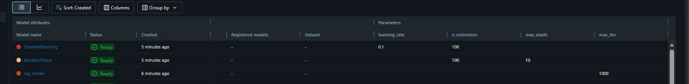
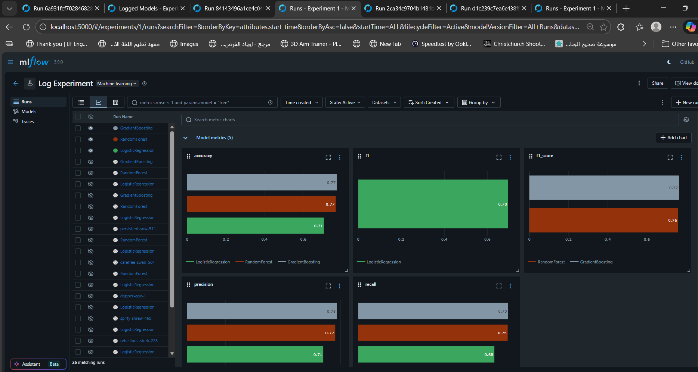
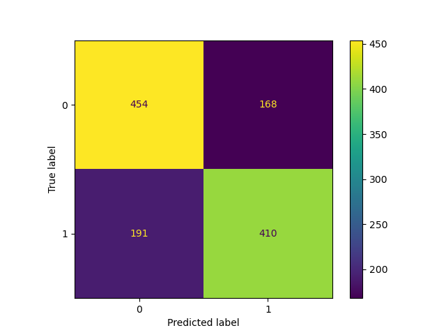
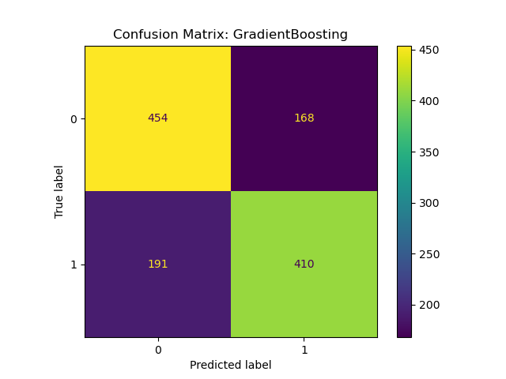
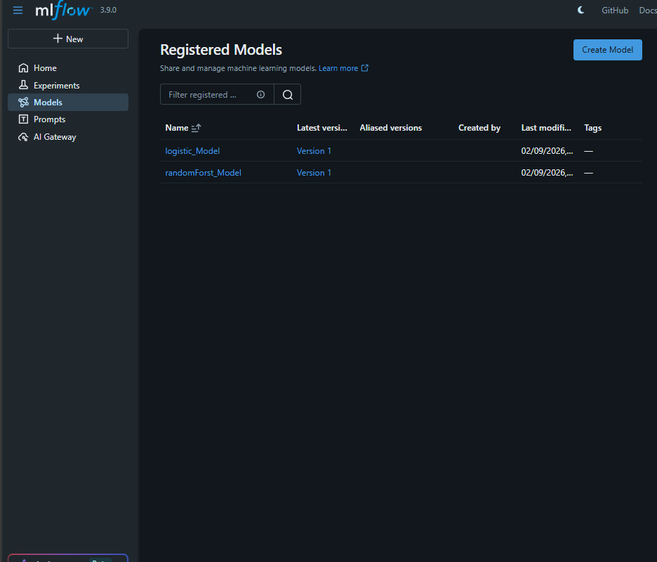

# 🏦 Bank Customer Churn Prediction with MLflow

[](https://www.python.org/)
[](https://mlflow.org/)
[](https://scikit-learn.org/)

## 📋 Table of Contents
- [Overview](#-overview)
- [Dataset](#-dataset)
- [Project Structure](#-project-structure)
- [Setup & Installation](#-setup--installation)
- [Running the Experiment](#-running-the-experiment)
- [MLflow Tracking](#-mlflow-tracking)
- [Models & Results](#-models--results)
- [Model Registry](#-model-registry)

---

## 🎯 Overview

This project is part of the **MLOps Course Labs** focusing on experiment tracking and model management using **MLflow**. The goal is to predict customer churn for a U.S. bank using machine learning models while tracking experiments, parameters, metrics, and artifacts with MLflow.

### Key Learning Objectives:
- ✅ Set up MLflow experiment tracking
- ✅ Log parameters, metrics, and artifacts
- ✅ Compare multiple ML models
- ✅ Register models for staging and production

---

## 📊 Dataset

**Bank Customer Churn Prediction Dataset**  
📎 [Kaggle Dataset Link](https://www.kaggle.com/datasets/shantanudhakadd/bank-customer-churn-prediction/data)

| Feature | Description |
|---------|-------------|
| `CreditScore` | Customer's credit score |
| `Geography` | Country (France, Spain, Germany) |
| `Gender` | Male/Female |
| `Age` | Customer's age |
| `Tenure` | Years as bank customer |
| `Balance` | Account balance |
| `NumOfProducts` | Number of bank products used |
| `HasCrCard` | Has credit card (1/0) |
| `IsActiveMember` | Active member status (1/0) |
| `EstimatedSalary` | Estimated annual salary |
| `Exited` | **Target** - Churned (1) or Retained (0) |

### Data Preprocessing:
1. **Feature Selection**: Relevant features extracted
2. **Rebalancing**: Downsampling majority class to handle class imbalance
3. **Encoding**: One-hot encoding for categorical variables (Geography, Gender)
4. **Scaling**: StandardScaler for numerical features

---

## 📁 Project Structure

```
MLOps-Course-Labs/
├── dataset/
│   └── Churn_Modelling.csv       # Dataset file
├── src/
│   └── train.py                  # Main training script with MLflow logging
├── src_Clean/                    # Modular code structure (BONUS)
│   ├── main.py                   # Entry point
│   ├── data_preprocessing.py     # Data preprocessing functions
│   └── train_model.py            # Model training functions
├── images/                       # Screenshots and visualizations
├── mlartifacts/                  # MLflow artifacts storage
├── mlflow.db                     # MLflow tracking database
├── requirements.txt              # Project dependencies
└── README.md                     # This file
```

---

## ⚙️ Setup & Installation

### 1. Fork the Repository
```bash
# Fork from: https://github.com/Heba-Atef99/MLOps-Course-Labs
# Make sure to UNCHECK "Copy the main branch only"
git clone https://github.com/<your-username>/MLOps-Course-Labs.git
cd MLOps-Course-Labs
git checkout research
```

### 2. Create Virtual Environment
```bash
# Using conda
conda create -n churn_prediction python=3.12
conda activate churn_prediction

# OR using venv
python -m venv churn_prediction
# Windows
churn_prediction\Scripts\activate
# Linux/Mac
source churn_prediction/bin/activate
```

### 3. Install Dependencies
```bash
pip install -r requirements.txt
```

### 4. Download Dataset
Download the CSV file from [Kaggle](https://www.kaggle.com/datasets/shantanudhakadd/bank-customer-churn-prediction/data) and place it in the `dataset/` folder.

---

## 🚀 Running the Experiment

### Step 1: Start MLflow Server
```bash
mlflow server --backend-store-uri sqlite:///mlflow.db --default-artifact-root ./mlartifacts --host 0.0.0.0 --port 5000
```

### Step 2: Run Training Script
```bash
cd MLOps-Course-Labs
python src/train.py
```

### Step 3: View Results
Open browser and navigate to: **http://localhost:5000**

---

## 📈 MLflow Tracking

### Experiment Dashboard

<p align="center">
  
</p>

*MLflow UI showing all experiment runs with metrics visualization*

---

### Metrics Comparison
<p align="center">
  
</p>


*Comparison of Accuracy, F1 Score, Precision, and Recall across all models*

---

### What We Log:

| Category | Items Logged |
|----------|-------------|
| **Parameters** | `max_iter`, `n_estimators`, `max_depth`, `learning_rate` |
| **Metrics** | `accuracy`, `precision`, `recall`, `f1_score` |
| **Artifacts** | `preprocessor.pkl`, `confusion_matrix.png`, trained models |
| **Tags** | `version`, `model` |
| **Data** | Training data logged via `mlflow.log_input()` |

### MLflow Functions Used:
```python
# Setup
mlflow.set_tracking_uri("http://localhost:5000")
mlflow.set_experiment("Log Experiment")

# Logging
mlflow.start_run(run_name="ModelName")
mlflow.log_param("param_name", value)
mlflow.log_metric("metric_name", value)
mlflow.log_artifact("file_path")
mlflow.set_tag("key", "value")

# Model Logging with Signature
signature = mlflow.models.infer_signature(X_train, predictions)
mlflow.sklearn.log_model(model, "artifact_path", signature=signature)

# Data Logging
dataset = mlflow.data.from_pandas(df, targets='Exited')
mlflow.log_input(dataset, context="training")

# Model Registration
mlflow.register_model(f"runs:/{run_id}/model_path", "model_name")
```

---

## 🤖 Models & Results

Three models were trained and compared:

### Model Comparison

| Model | Accuracy | Precision | Recall | F1 Score |
|-------|----------|-----------|--------|----------|
| Logistic Regression | 0.71 | 0.71 | 0.68 | 0.70 |
| Random Forest | 0.77 | 0.77 | 0.75 | 0.77 |
| Gradient Boosting | 0.77 | 0.76 | 0.75 | 0.76 |

---

### Confusion Matrices

<table>
  <tr>
    <td align="center">
      <br/>
      <b>Logistic Regression</b>
    </td>
    <td align="center">
      <br/>
      <b>Random Forest</b>
    </td>
    <td align="center">
      <br/>
      <b>Gradient Boosting</b>
    </td>
  </tr>
</table>

---

## 📦 Model Registry

### Registered Models

<p align="center">
  
</p>
*MLflow Model Registry showing registered models with their status*

---

### Selected Models:

#### 🟢 Production: Random Forest
- **Justification**: Highest overall F1 score (0.77) and balanced precision-recall. Best generalization on unseen data.
- **Run ID**: `3690f8b291404a2cbbb18de2ba6846e9`
- **Best for**: Production deployment due to robust performance

#### 🟡 Staging: Logistic Regression  
- **Justification**: Simpler model, faster inference, good baseline, and highly interpretable.
- **Run ID**: `4d758d580a204ac4b0f1bfe06bb86067`
- **Best for**: Quick inference scenarios, model interpretability

### Why These Choices?

| Criteria | Random Forest (Production) | Logistic Regression (Staging) |
|----------|---------------------------|------------------------------|
| **F1 Score** | 0.77 ✅ | 0.70 |
| **Precision** | 0.77 | 0.71 |
| **Recall** | 0.75 | 0.68 |
| **Interpretability** | Medium | High ✅ |
| **Inference Speed** | Medium | Fast ✅ |

---

## 🏗️ Clean Code Structure (BONUS)

The `src_Clean/` directory contains a modular refactored version:

| File | Purpose |
|------|---------|
| `main.py` | Entry point, orchestrates the pipeline |
| `data_preprocessing.py` | Data loading, cleaning, feature engineering |
| `train_model.py` | Model training, logging, evaluation |

---

## 📝 Notes

- ⚠️ **Do NOT use** `mlflow.autolog()` - manual logging required
- 📌 Original comments in `train.py` are preserved as per requirements
- 🔄 Class imbalance handled via downsampling

---

## 👤 Author

**Ahmed Selem**  
ITI - MLOps Course

---

## 📚 Resources

- [MLflow Documentation](https://mlflow.org/docs/latest/index.html)
- [Kaggle Dataset](https://www.kaggle.com/datasets/shantanudhakadd/bank-customer-churn-prediction/data)
- [Original Repo](https://github.com/Heba-Atef99/MLOps-Course-Labs)
